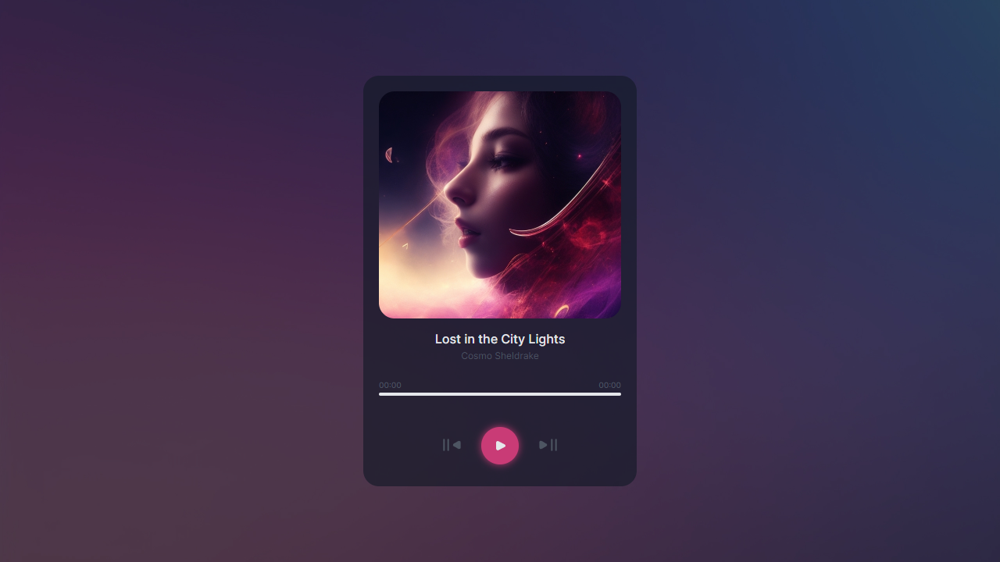

# music-player
A simple music player that cycles through 2 songs with a click of a button. This project is my solution to this [**challenge**](https://devchallenges.io/challenge/36) found on devChallenge. I used HTML, CSS and vanilla JS with a focus on better folder structuring and implementing JS modules.

## Preview

[Live Demo](https://kimhnh.github.io/music-player/) / [devChallenges](https://devchallenges.io/solution/3000)
